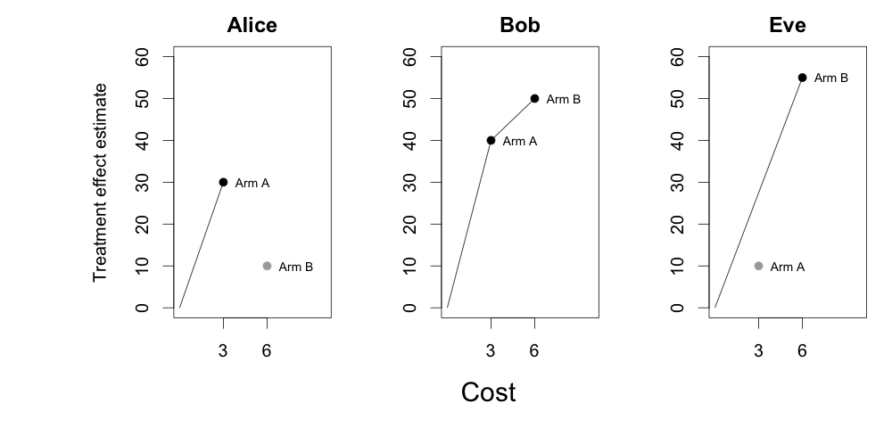
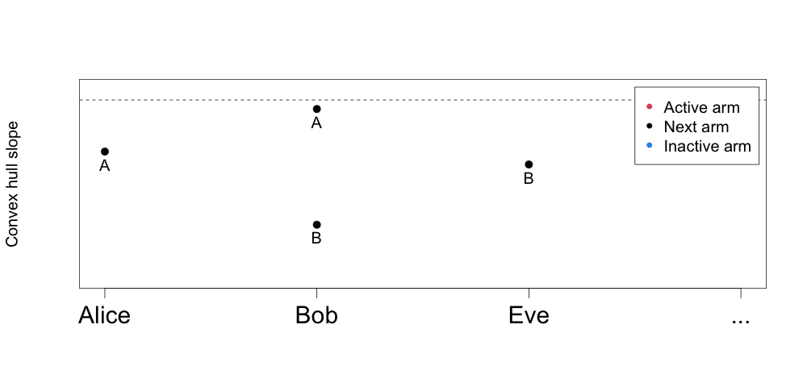

# The MAQ Algorithm

This document gives a brief high-level overview of the algorithm underlying Qini curves for multi-armed treatment rules (for complete details we refer to [this paper](https://arxiv.org/abs/2306.11979)).

A popular approach to derive data-driven treatment rules is to use estimates of the conditional average treatment effect (CATE) to decide who to treat. The table below shows an example of CATE estimates for three hypothetical units, Alice, Bob, and Eve, for two example interventions: treatment arm **A** and treatment arm **B**.

| Unit  | CATE estimates for Arm A | CATE estimates for Arm B |
|-------|--------------------------|--------------------------|
| Alice | 30                       | 10                       |
| Bob   | 40                       | 50                       |
| Eve   | 10                       | 55                       |

If we imagine the two treatment arms incur the same costs, or if costs are not at all relevant when assigning treatment, then it's conceptually straightforward to evaluate and visualize a treatment rule using the above estimates via a **Qini** curve: simply sort units in decreasing order of CATE estimates, then calculate the gain (or uplift), as we increase the fraction treated (or average cost we incur).

In many practical applications, different treatment arms carry different costs. For example, treatment arm **A** could be a low-cost online student counseling program, and treatment arm **B** could be a costlier guided program. Our CATE estimates could measure, for example, how much a student's test score increases when given a training program as opposed to being given nothing (the control arm). Let's assume the cost of assigning **A** is **3** (on some chosen denomination, perhaps 100's of $), and the cost of assigning arm **B** is **6**.

How can we analyze a treatment rule that **optimally** uses both our treatment arms as we vary the average amount we are willing to spend? Constructing a Qini curve is not as straightforward anymore, since at every budget level we must choose between assigning some unit an initial intervention or upgrading another unit to a costlier but more effective intervention. This constrained choice problem is a (linear) multiple-choice knapsack problem. At every budget level (knapsack capacity) we have to optimally decide which unit and which treatment arm to assign such that the average cost is less than or equal to the budget level.

To make progress on this, it is helpful to represent the table above differently. In the figure below, we plot estimated treatment effects on the y-axis and the cost of assigning that arm on the x-axis, for all the units.

For a given knapsack capacity, the only set of arms we will choose from lies on the upper-left convex hull of the figures above (Kellerer et al., 2004, Chapter 11). For Alice, treatment arm **B** does not lie on the hull since it has a higher cost, but lower estimated reward than arm **A**. For Bob, both treatment arms lie on the convex hull. It turns out that for a given knapsack capacity, the arms and units we will put in the knapsack are those whose convex hull slopes are above a certain threshold.

We can use this property to construct an algorithm that delivers our optimal choices (which unit to assign which arm) as we increase the knapsack capacity. Just like in creating Qini curves for single-armed treatments, it is going to involve sorting, except that now we are going to sort by decreasing *incremental convex hull slopes*.

The animated figure below highlights how our treatment effects estimates for the two costly interventions **A** and **B** give rise to a multi-armed treatment rule over varying budget constraints. The y-axis is the slope between arms on a unit's convex hull (from the figure above), and the x-axis is the unit. The unit and arm that is active in the solution over increasing budget levels can be found by lowering the horizontal threshold (dotted line) and keeping track of whether we are assigning a new unit an arm, or upgrading an existing unit to a costlier arm.

This is the multi-armed policy the MAQ package is computing (and estimating the value of via for example inverse-propensity weighting or augmented inverse-propensity weighting). As an example, at an average spend equal to 5, the estimated multi-armed policy is to assign Alice arm A, Bob arm B, and Eve arm B, for a total average cost of (3 + 6 + 6) / 3 = 5.

## References
Hans Kellerer, Ulrich Pferschy, and David Pisinger. *Knapsack problems*. Springer, 2004.
